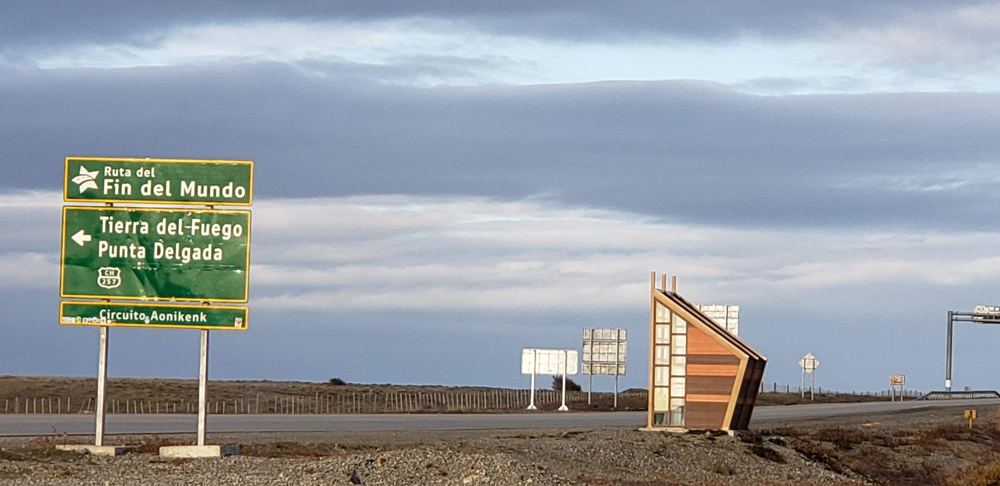
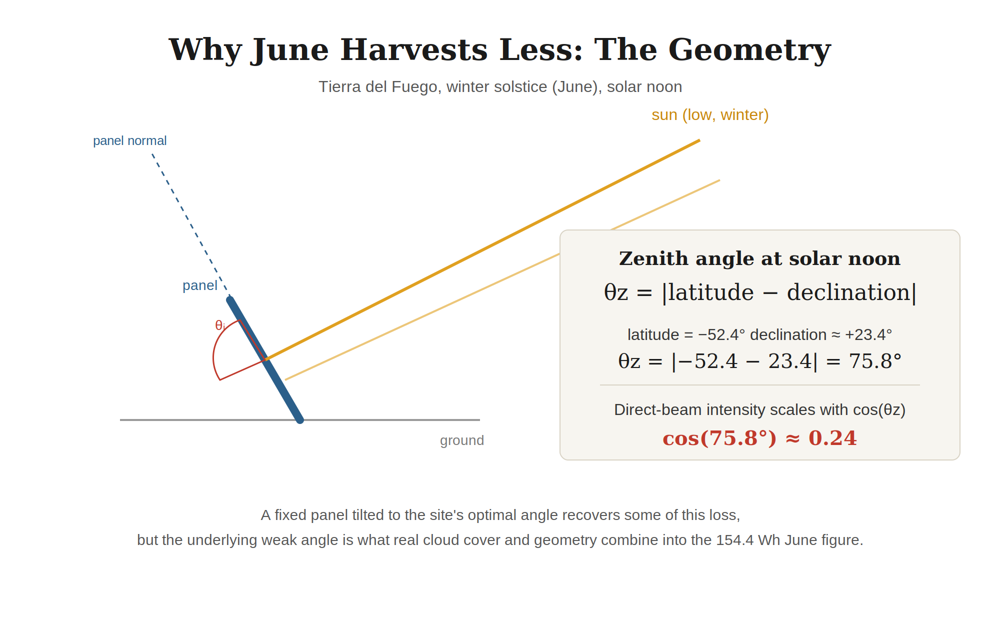

<!-- SEO TITLE: Understanding Solar for IoT: The Tierra del Fuego Problem -->
<!-- SEO DESCRIPTION: A solar sizing case study for a remote LoRaWAN gateway near Tierra del Fuego: real climate data, hardware specs, and why the culprit was never latitude alone. -->

# Understanding Solar for IoT: The Tierra del Fuego Problem

*Damian Bucovsky, President at The Shadow on the Moon*

Every solar-powered deployment starts with a version of the same napkin calculation. Rated panel wattage, a rule-of-thumb number of sun hours per day, and a battery big enough to ride out a cloudy stretch. It almost always looks comfortable. It looked comfortable here too, for a remote LoRaWAN gateway proposed for an oil field near the southern tip of Chile, not far from Tierra del Fuego. But nature and physics doesn't care how clean the napkin math looks.

I had a head start on this one, or at least I thought I did. Years earlier, on a refrigerated rail project in Canada, I had watched a fleet of solar-charged devices pass a full year in the field before a slow, seasonal failure pattern showed up that nobody had modeled for. That project taught me to distrust annual averages and simplifications when dealing with solar recharge, but solar failures rarely repeat themselves exactly.

## The setup

The project, working with Blink, involved monitoring oil field wellheads in the far south of Chile. The large, high-value well pads already had monitoring: full SCADA systems, multimillion-dollar installations, fully manned, grid-powered, the whole thing tied into satellite or cellular telemetry. What had none of that were the small, isolated wellheads scattered around them, either too low in extraction capacity to justify that kind of investment, or already deep into their tail-end, stripper-well production phase where a multimillion-dollar SCADA buildout would never pencil out. Those sites had no grid power, no cell coverage, and no remote monitoring at all beyond a technician driving out in a pickup truck once or twice a week. The idea was straightforward: scatter cheap sensors around each of these smaller pads, talk to them over BLE to keep power budgets tiny, and concentrate everything through a local LoRaWAN gateway, an eight-channel MultiTech Conduit, that would forward the data onward. The gateway had to run continuously, unattended, for months at a time, off a battery kept topped up by a small solar panel.

I pushed for a custom charging strategy from the start, telling the customer that battery and solar together were trickier than they looked. That we needed to actually sit down and work through it. The customer had done this before, in other locations, with similar equipment, and it had worked well enough for them. Pushing for something more deliberate, for a device that idles most of the day, read as over-engineering to them and I understood their reaction.

## The math that agreed with them

Start with the load, everything else gets measured against it. The version used for this analysis is the standard indoor-rated Conduit gateway, not MultiTech's ruggedized IP67 outdoor variant. Either way, a proper weatherproof enclosure is needed to house the charge controller and battery connections regardless of which gateway sits inside it, so the choice doesn't change what actually needs engineering, and the indoor-rated model is cheaper and much more likely to be stocked by distributors. MultiTech's own published power draw figures for the Conduit LoRaWAN gateway put it at roughly 467 mA continuously at 12V, which works out to about 135 Wh per day, running 24/7, with no real idle mode. ([Full derivation](https://github.com/dbucovsky/article-appendix/blob/main/solar-iot-tdf/tdf-solar-modeling-reference.md#2-load-derivation).)

Against that number, a plain rule-of-thumb sizing calculation looks almost too good. Assume something like four to five hours of usable sun per day, a generic 0.8 derate for wiring and inefficiency, and a 175W panel*, and you get:

**175W panel x 4 sun-hours/day x 0.8 generic derate = 560 Wh/day**

**175W panel x 5 sun-hours/day x 0.8 generic derate = 700 Wh/day**

That is a margin of 4.2x to 5.2x over the load, using nothing more specific than a number a generic solar calculator would produce anywhere in the world.

*\* Fifty to eighty watts is roughly the range real commercial vendors size around for a gateway in this class. Voltaic Systems, a solar-for-IoT vendor that says it ships roughly a million panels a year, publishes a sizing rule for a comparable MultiTech gateway that works out to about 53-66W for this exact load; RAKwireless, separately, bundles its commercial-grade WisGate Edge Pro gateway with an 80W solar kit. This design called for a bit more than double that upper figure as an added safety margin. ([Full sourcing](https://github.com/dbucovsky/article-appendix/blob/main/solar-iot-tdf/tdf-solar-modeling-reference.md#11-panel-size-rationale).)*

> **Pushing for something more deliberate, for a device that idles most of the day, read as over-engineering to them and I understood their reaction.**

The customer knew better and did not stop there for more than a second. It was a handful of engineers in total, most based in Punta Delgada, a small town near the wellheads, one or two in other nearby towns, and maybe one further out in Punta Arenas, Chile, or Río Gallegos, Argentina. Nobody was based any further away than that, and every one of them knew the region firsthand. Nobody on their side needed convincing that a rule of thumb built for a rooftop installation in a mild climate had no business being applied a few hundred kilometers from Tierra del Fuego. So they went looking for something closer to real.

They knew to use a full-year average using actual climate data for the site. Tierra del Fuego averages around 40 percent of possible sunshine annually (Punta Arenas climate normals, cross-checked across climatestotravel.com, weather-atlas.com, and nomadseason.com), with real seasonal swing baked into that number rather than smoothed away by a rule of thumb. Run the numbers again for the same panel against this real annual insolation, assume a near 100 percent peak conversion efficiency; you get roughly 413 Wh per day from the solar panel averaged across the year. A healthy 3.1x margin over the load; and that is with real climate data, still a very nice and safe margin. ([Full monthly breakdown](https://github.com/dbucovsky/article-appendix/blob/main/solar-iot-tdf/tdf-solar-modeling-reference.md#4-real-annual-insolation-idealized-no-hardware-losses).)

None of those numbers fell right, specially when standing at the actual wellheads, as I had, and they had a lot more than me. But it is easy to forget what you know or felt on-site once you are back at a desk designing. Signal out there was bad, zero to one bar most of the time, nothing close to the conditions the gateway's published power figures assume. My one and only visit at the end of March 2019 was cold enough; outside I needed a heavy jacket and thermal underwear. What I had not expected was to have to check every morning the UV index and the day's outdoor recommendations, posted at the main office, before we were taken out to visit the sites. The site's admin office ran a microcell off a satellite backhaul specifically because normal coverage could not be trusted there. The wellheads themselves had no such luxury. Whatever signal happened to reach them was what they got, and a modem straining for a weak, distant connection draws meaningfully more than one sitting comfortably close to a tower, in ways no datasheet for this hardware is going to capture. That is not something I could fold cleanly into the math above. It is something worth keeping in the back of your mind as the numbers below start to move.

## Where the math breaks

The averages hide the worst months; stop averaging and look at Tierra del Fuego's weakest month by itself, and the comfortable 3.1x margin turns into barely breaking even. From more than three times what is needed, we rapidly land at just enough; and just enough is not a safe place to live. The physics never changed between the two calculations. What changed was which month happened to be checked: an idealized month, an honest average month, or the worst one.

Looking back at this six years later, while writing this piece, I found myself wondering: what would this same math have looked like somewhere that was not the end of the world? The road running past the closest crossing point is literally called Ruta del Fin del Mundo, the Route of the End of the World, and it is not hard to see why.

*Sign marking the turnoff toward Tierra del Fuego and Punta Delgada, photographed by Damian Bucovsky, March 2019.*

So I built a comparison across multiple wildly different latitudes including Tierra del Fuego, NYC, Miami and London among others. The first surprise was that Tierra del Fuego is not obviously the worst site.

Look at a map: north on top, Europe and North America centered; even I, having been born in the southern hemisphere, see more of the north than anything else. Tierra del Fuego reads as impossibly far south, a place near the edge of the map, while London just reads as a normal city that happens to be a bit gray. London is 51.5° north. Tierra del Fuego is 52.4° south. Practically mirror images of each other, just on opposite sides of the equator. Once you notice that, the comparison stops feeling exotic and starts feeling like the fair fight it actually is. A fixed solar panel mounted at an angle optimized for the location, in Tierra del Fuego, when you average out for a year, actually outperforms one in London. High southern latitudes trade a lower sun angle for dramatically longer summer days. It is short winter days that make people nervous about extreme latitude sites. It turns out summer, at the same latitude, is quietly doing a lot of compensating work that nobody credits it for.

This comparison is a very interesting curiosity; it deserves its own full treatment, not a rushed paragraph tucked into some other story (I will write it up over the next few weeks). It is also not what actually explained some of the other times the customer had to swap batteries in the projects that worked well in the middle of winter, justifying these as routine maintenance issues rather than design flaws nobody had traced back to a root cause. What explained it back in 2019, with no multi-city comparison nonsense, was details on the site itself.

## Getting honest

None of what follows is Tierra del Fuego getting harsher, the site did not change, but I want to walk you through how the model gets more complex and more truthful, and what shows up once it does.

Start from where this piece already left off. The naive rule of thumb at the very beginning promised 4.2x to 5.2x more power than the load needed, using nothing specific to this location at all. That is the floor everything below has to be measured against.

| Stage | Harvest Energy | Excess Energy | Battery Minimum¹ | Dead days |
|---|---|---|---|---|
| Naive rule of thumb (generic, no site data) | 560-700 Wh | +316% to +420% | n/a | n/a |

Start with geometry alone, nothing else considered. June is the depths of winter in Tierra del Fuego, the shortest, weakest-sun days of the year, Chile's equivalent of December in London or New York. Even at the correctly optimized fixed tilt for this latitude, both effects cost real energy: short daylight hours, and the low angle the sun sits at during the ones it gets.

*Why June harvests less: at solar noon on the June solstice, the sun sits 75.8° from directly overhead in Tierra del Fuego, and direct-beam intensity falls with the cosine of that angle. This is the physical mechanism behind every geometry-driven number in this section.*

> **The site did not change, but I want to walk you through how the model gets more complex and more truthful, and what shows up once it does.**

Geometry alone, nothing else added, still leaves June harvesting 422.1 Wh against a 135 Wh load. Comfortable. Even generous.

| Stage | Harvest Energy | Excess Energy | Battery Minimum¹ | Dead days |
|---|---|---|---|---|
| Naive rule of thumb (generic, no site data) | 560-700 Wh | +316% to +420% | n/a | n/a |
| Geometry alone | 422.1 Wh | +214% | 100% | 0 |

*¹ All Harvest Energy and Excess Energy figures below the naive row are for June, Tierra del Fuego's worst month.*

The next thing the model had been assuming away was a clean panel. Every wattage rating on a solar panel's spec sheet comes from a lab, under glass, with nothing on the surface but the coating it shipped with. Tierra del Fuego is windy enough that dust and grit do not settle on a panel so much as get driven into it, and nobody was running out to a remote wellhead on a schedule built around keeping a panel spotless. Add a realistic soiling loss for that kind of environment, eight percent², and June's harvest drops again, from 422.1 Wh to 388.3 Wh. Eight percent was not a number I had sourced in 2019. It was an estimate, made deliberately on the conservative side, the way you learn to when there is no real data and being wrong in the wrong direction costs more than being wrong in the right one. Revisiting it now, years later, against published research that did not exist in front of me at the time, the estimate holds up. Not because I got lucky, but because the underlying principle, dry and windy environments soil harder than average, does not change from one hemisphere to another. Dust is not political.

| Stage | Harvest Energy | Excess Energy | Battery Minimum¹ | Dead days |
|---|---|---|---|---|
| Naive rule of thumb (generic, no site data) | 560-700 Wh | +316% to +420% | n/a | n/a |
| Geometry alone | 422.1 Wh | +214% | 100% | 0 |
| + wind and dust soiling | 388.3 Wh | +189% | 100% | 0 |

*¹ All Harvest Energy and Excess Energy figures below the naive row are for June, Tierra del Fuego's worst month.*

² NREL's soiling estimation method, and the finding that dust concentration and dry conditions drive the worst losses, come from Deceglie, Micheli, and Muller, "Quantifying Soiling Loss Directly From PV Yield," IEEE Journal of Photovoltaics, 2018, and Micheli, Deceglie, and Muller, "Mapping Photovoltaic Soiling Using Spatial Interpolation Techniques," IEEE Journal of Photovoltaics, 2018. Both studies are US-based; the mechanism, not the specific geography, is what generalizes to Tierra del Fuego. [Full sourcing and derivation in the reference document](https://github.com/dbucovsky/article-appendix/blob/main/solar-iot-tdf/tdf-solar-modeling-reference.md#7-soiling).

Next comes the battery. Lead-acids lose usable capacity in the cold, common knowledge for anyone who has worked with them, and June is not just weak on sun. If March already needed a heavy jacket and thermal underwear just to stand outside for a morning, June, the actual coldest stretch of the year, is worse, and the daily average the model uses, 2.5°C (36.5°F), is itself being generous. Real winter nights in the region routinely drop below freezing, and the area sees roughly 43 nights a year below 0°C (32°F), some approaching -9°C (16°F) (same climate-normal sources as above). A 100Ah battery rated at 25°C does not deliver 100Ah at 2°C, let alone on the coldest nights hiding inside that average. On paper, that should hurt. In practice, on its own, it does nothing at all. A battery sized generously enough never notices a shrunken ceiling it was never going to bump into anyway. ([Temperature data and sourcing](https://github.com/dbucovsky/article-appendix/blob/main/solar-iot-tdf/tdf-solar-modeling-reference.md#6-temperature-data-used).)

What actually makes the cold matter is a second, separate constraint: once it reaches its ceiling, month over month, entering winter with a limited reserve matters. There is no way to get to June full. Combine the two, cold-shrunk capacity and a ceiling that will not let surplus carry forward, and the number finally moves.

| Stage | Harvest Energy | Excess Energy | Battery Minimum¹ | Dead days |
|---|---|---|---|---|
| Naive rule of thumb (generic, no site data) | 560-700 Wh | +316% to +420% | n/a | n/a |
| Geometry alone | 422.1 Wh | +214% | 100% | 0 |
| + wind and dust soiling | 388.3 Wh | +189% | 100% | 0 |
| + cold-shrunk capacity, clipping enforced | 388.3 Wh | +189% | 60% | 0 |

*¹ All Harvest Energy and Excess Energy figures below the naive row are for June, Tierra del Fuego's worst month. Each month's harvest is calculated once, from that month's mid-point sun geometry, then applied identically to every day within the month rather than modeled day by day; the battery's response to that repeated value is still tracked one real day at a time.*

Next comes the piece of hardware nobody thinks to question: the charge controller itself. Every number so far assumed near-perfect conversion between the panel and the battery, which is not how a real, commercially available MPPT controller behaves. A controller like the Renogy Rover 20A, sized correctly for this panel, available for somewhere between 70 and 100 dollars, not a special order or an exotic choice, is rated at 98 percent peak conversion efficiency (per Renogy's own product listing and the official Rover Li Series user manual). That number is true. It is also the number every spec sheet leads with, not the number that governs what happens on a weak day. The other half of the picture is a fixed self-consumption draw, published at under 100 milliamps at 12 volts, a little over a watt, that the controller pulls just to keep its own tracking electronics running, whether the panel is putting out its full 175 watts or struggling to manage 20. It is genuinely small. It is not zero, and unlike the panel's own output, it does not shrink with the weather. ([Full specs and sourcing](https://github.com/dbucovsky/article-appendix/blob/main/solar-iot-tdf/tdf-solar-modeling-reference.md#9-real-charge-controller).)

Swap the idealized charging assumption for this real controller's real behavior, and June's harvest drops from 388.3 Wh to 359.5 Wh. Barely a dent. Dust, cold, and an ordinary charge controller's own overhead, three real, separate problems, stacked on top of each other, and the system is still standing at a 167 percent margin.

| Stage | Harvest Energy | Excess Energy | Battery Minimum¹ | Dead days |
|---|---|---|---|---|
| Naive rule of thumb (generic, no site data) | 560-700 Wh | +316% to +420% | n/a | n/a |
| Geometry alone | 422.1 Wh | +214% | 100% | 0 |
| + wind and dust soiling | 388.3 Wh | +189% | 100% | 0 |
| + cold-shrunk capacity, clipping enforced | 388.3 Wh | +189% | 60% | 0 |
| + a real off-the-shelf MPPT charge controller | 359.5 Wh | +167% | 60% | 0 |

*¹ All Harvest Energy and Excess Energy figures below the naive row are for June, Tierra del Fuego's worst month. Each month's harvest is calculated once, from that month's mid-point sun geometry, then applied identically to every day within the month rather than modeled day by day; the battery's response to that repeated value is still tracked one real day at a time.*

Now let's add one more thing we have quietly assumed away: no clouds in view. June in Tierra del Fuego is not clear. Actual recorded cloud cover for the month runs at about 32% of possible sunshine; swapping this in drops June's harvest from 359.5 Wh to 95.5 Wh in one step. Not a decline; a collapse. Three real problems, each one individually survivable, and even stacked together, barely moved the number. It took an ordinary cloudy month to do the real damage.

| Stage | Harvest Energy | Excess Energy | Battery Minimum¹ | Dead days |
|---|---|---|---|---|
| Naive rule of thumb (generic, no site data) | 560-700 Wh | +316% to +420% | n/a | n/a |
| Geometry alone | 422.1 Wh | +214% | 100% | 0 |
| + wind and dust soiling | 388.3 Wh | +189% | 100% | 0 |
| + cold-shrunk capacity, clipping enforced | 388.3 Wh | +189% | 60% | 0 |
| + a real off-the-shelf MPPT charge controller | 359.5 Wh | +167% | 60% | 0 |
| + real June cloud cover | 95.5 Wh | -29% | 0% | 42 |

*¹ All Harvest Energy and Excess Energy figures below the naive row are for June, Tierra del Fuego's worst month. Each month's harvest is calculated once, from that month's mid-point sun geometry, then applied identically to every day within the month rather than modeled day by day; the battery's response to that repeated value is still tracked one real day at a time.*

Forty-two days a year with a dead battery, concentrated in June, is a real number worth being precise about, not a rounding error, but also not quite what it might sound like at first. It does not mean the gateway sits dark for six straight weeks. Overnight, on a day like this, it is genuinely dark, whatever charge survived from the day before is gone by sunrise, and there is no sun yet to change that. Once the sun clears the horizon and panel output climbs past what the gateway is actually drawing, the gateway comes back, and stays up for some real stretch of the day. As the afternoon sun drops, output falls back below the load again, the gateway goes dark, and whatever it picked up during that window was not enough to survive the coming night. The next day, the same shape repeats. What changes, day to day, and what would change with a bigger panel or a better month, is how wide that working window is, not whether the pattern holds. A system flickering like that through forty-two of its worst days a year, dark overnight, partially alive by day, still is not a system anyone should be comfortable fielding. It is just a narrower, quieter failure than "dark for six weeks" would suggest, and an honest one is more useful than a dramatic one. ([Full explanation, including a real charge-controller caveat](https://github.com/dbucovsky/article-appendix/blob/main/solar-iot-tdf/tdf-solar-modeling-reference.md#101-what-a-dead-battery-day-actually-represents).)

I do not want to blame clouds for every failed solar estimate. On a different project, in a different climate, I might be writing this same section about dust, or cold, or a controller cutting corners nobody thought to check, or something that has not shown up in this piece at all. I never set out to find the single worst factor. There is rarely just one, and even an honest, careful estimate tends to catch the first thing it checks and stop looking. Catching the one that actually breaks a system, in my experience, comes from having already been burned by a different one somewhere else.

> **Forty-two days a year with a dead battery, concentrated in June, is a real number worth being precise about, not a rounding error.**

## What actually fixes it

A charge controller does not have to run one strategy all the time. A well-designed one can sense how much current the panel is actually able to deliver, and switch behavior accordingly: standard MPPT tracking when there is enough light to make the tracking worth its own overhead, and a lower-overhead pump-and-dump strategy, accumulating charge quietly and releasing it in efficient bursts, specifically during the hours when continuous tracking would spend more than it earns. The switch happens automatically, based on what the panel can actually deliver in that moment, not on a fixed schedule or a guess.

Model that mixed strategy in place of the off-the-shelf controller, everything else unchanged, soiling, cold-shrunk capacity, real June clouds, all still in the picture, and June's harvest recovers to 129.7 Wh. Still fractionally short of the load on its own, -4 percent, but the smarter charging banks enough real surplus in the months around June that the battery carries a reserve into winter instead of arriving empty. The year's minimum state of charge lands at 49 percent. Never below half. Zero dead days.

| Stage | Harvest Energy | Excess Energy | Battery Minimum¹ | Dead days |
|---|---|---|---|---|
| Naive rule of thumb (generic, no site data) | 560-700 Wh | +316% to +420% | n/a | n/a |
| Geometry alone | 422.1 Wh | +214% | 100% | 0 |
| + wind and dust soiling | 388.3 Wh | +189% | 100% | 0 |
| + cold-shrunk capacity, clipping enforced | 388.3 Wh | +189% | 60% | 0 |
| + a real off-the-shelf MPPT charge controller | 359.5 Wh | +167% | 60% | 0 |
| + real June cloud cover | 95.5 Wh | -29% | 0% | 42 |
| + a mixed MPPT and pump-and-dump strategy | 129.7 Wh | -4% | 49% | 0 |

*¹ All Harvest Energy and Excess Energy figures below the naive row are for June, Tierra del Fuego's worst month.*

Same panel, battery, wind, dust, cold, weak June sun, real clouds, same everything. The only change is being smart about harvesting from the panel all the time, or as close to all the time as possible, instead of wasting the sun's power below the critical threshold. In the short winter days, that delta is significant.

It is worth being honest about what this fix actually depends on. The mixed charging strategy did not rescue the system through cleverness alone. It rescued a system that already had enough real panel capacity underneath it to work with. Run the same smart charging against a 100W panel, closer to what a generic sizing rule alone would recommend, and the fix stops being a fix: the system still logs dozens of dead days a year, deep into winter, smart charging or not. Smarter charging always recovers some of what a naive controller wastes. It cannot manufacture energy a panel too small to begin with never collected.

A bigger panel is also a real option here, and it deserves to be taken seriously, not waved off as the brute-force choice. It is genuinely simpler: no custom charging logic, nothing to design, nothing that needs debugging out in the field, just a larger, entirely off-the-shelf part. It is worth noting the customer's own instinct ran the other way. Their easy napkin math was, I believe unconsciously, a means to justify staying small in the first place, a modest panel looking comfortably sufficient was the answer they wanted, and going bigger was never really on their table until the real numbers made staying small look risky. Tierra del Fuego does push back on the idea a little. More surface area catches more wind, and research on wind-induced vibration in PV modules† has found that larger panels see meaningfully more mechanical stress from it, real risk of microcracking, misalignment, and structural fatigue over time, not just a bigger bracket needed to hold it down. Weighed against a custom charging strategy, with nothing standard about it and everything to get right the first time, a bigger panel is very likely the lower-risk path, and maybe the better one. Working through the full estimate was never really about proving the smart controller was the only right answer. It was about understanding the problem well enough to assess what really was in play and what options were on the table; engineering a solution, not catching lightning in a bottle.

† Kumar et al., reported in Emiliano Bellini, "The impact of wind-induced vibrations on solar modules," pv magazine International, January 14, 2025. The study, from a UAE and Singapore-based research team, found wind-induced torsional stress leads to microcracks, misalignment, and mechanical failure, with larger panels experiencing meaningfully greater stress.

> **Run the same smart charging against a 100W panel, closer to what a generic sizing rule alone would recommend, and the fix stops being a fix: the system still logs dozens of dead days a year, deep into winter, smart charging or not.**

## Lessons from Tierra del Fuego

I said at the start that I had a head start on this one, from an earlier solar-charged deployment that failed slowly and seasonally, years before Tierra del Fuego. Looking back now, I think that head start was mostly a feeling, not a transferable answer. Nothing about that earlier failure told me what would break here. What it left me with was narrower and more useful: the certainty that averages lie, generalizations hide specificities, and assumptions tend to overstate some conditions and understate others; the specifics keep changing, but the errors remain.

Tierra del Fuego's failure was a stack of ordinary problems, none of them exotic on their own, wind-driven soiling, a cold-shrunk battery, a real charge controller's own overhead. Each one individually survived being checked. None of them broke the system by itself. What broke it was June's real weather sitting on top of all three at once, and no single-factor check was ever going to catch that.

Sizing a system for a hard climate does not actually require skepticism that the panel will work. It requires skepticism of any single number that claims to already know whether it will.

If there is one practical takeaway here, it is this: work through the real factors one at a time before trusting a summary number, whether that number looks comfortable or looks broken. A margin that reads as 5x can hide a system that only survives because nobody checked its worst month. A margin that reads as a failure can turn out to be one real engineering decision away from working fine. Both showed up in this same piece.

> **Sizing a system for a hard climate does not actually require skepticism that the panel will work. It requires skepticism of any single number that claims to already know whether it will.**

---

**Further reading, full supporting data:**
- [Full modeling methodology, sourcing, and known limitations](https://github.com/dbucovsky/article-appendix/blob/main/solar-iot-tdf/tdf-solar-modeling-reference.md)
  https://github.com/dbucovsky/article-appendix/blob/main/solar-iot-tdf/tdf-solar-modeling-reference.md
- [Geometry-versus-weather comparison against London](https://github.com/dbucovsky/article-appendix/blob/main/solar-iot-tdf/tdf-solar-modeling-reference.md#13-minimum-justification-for-the-multi-city-comparison), the minimum evidence behind this piece's latitude claim
  https://github.com/dbucovsky/article-appendix/blob/main/solar-iot-tdf/tdf-solar-modeling-reference.md#13-minimum-justification-for-the-multi-city-comparison
- [MultiTech Systems, MTAC-LORA Power Draw documentation](https://www.multitech.net/developer/products/multiconnect-conduit-platform/accessory-cards/mtac-lora/mtac-lora-power-draw/), the source for this piece's load figure
  https://www.multitech.net/developer/products/multiconnect-conduit-platform/accessory-cards/mtac-lora/mtac-lora-power-draw/
  Offline copy: https://github.com/dbucovsky/article-appendix/blob/main/solar-iot-tdf/external-ref/mtac-lora-power-draw.pdf
- [Voltaic Systems, "Solar Power for LoRaWAN Gateways"](https://multitech.com/wp-content/uploads/Voltaic-Solar-Systems-for-Multitech-2024-04-11-1.pdf), independent load cross-check and the sizing rule behind this piece's panel-size reasoning
  https://multitech.com/wp-content/uploads/Voltaic-Solar-Systems-for-Multitech-2024-04-11-1.pdf
  Offline copy: https://github.com/dbucovsky/article-appendix/blob/main/solar-iot-tdf/external-ref/Voltaic-Solar-Systems-for-Multitech-2024-04-11-1.pdf
- [RAKwireless, WisGate Edge Pro Solar bundle](https://store.rakwireless.com/products/wisgate-edge-pro-battery-plus-solar-panel-kit), the real commercial 80W reference point
  https://store.rakwireless.com/products/wisgate-edge-pro-battery-plus-solar-panel-kit
  Offline copy: https://github.com/dbucovsky/article-appendix/blob/main/solar-iot-tdf/external-ref/accessories-solar-panel-kit-80w-solar-panel-for-battery-plus-datasheet.pdf
- [Renogy Rover 20A MPPT Solar Charge Controller](https://www.renogy.com/collections/all/products/rover-li-20-amp-mppt-solar-charge-controller), the real off-the-shelf controller modeled in this piece
  https://www.renogy.com/collections/all/products/rover-li-20-amp-mppt-solar-charge-controller
  Offline copy: https://github.com/dbucovsky/article-appendix/blob/main/solar-iot-tdf/external-ref/RVR203040-Manual.pdf
- [Deceglie, Micheli, and Muller, "Quantifying Soiling Loss Directly From PV Yield," IEEE Journal of Photovoltaics, 2018](https://www.osti.gov/servlets/purl/1419409), the soiling estimation methodology
  https://www.osti.gov/servlets/purl/1419409
  Offline copy: https://github.com/dbucovsky/article-appendix/blob/main/solar-iot-tdf/external-ref/deceglie-micheli-muller-2018-quantifying-soiling-loss.pdf
- [Micheli, Deceglie, and Muller, "Mapping Photovoltaic Soiling Using Spatial Interpolation Techniques," IEEE Journal of Photovoltaics, 2018](https://www.osti.gov/pages/biblio/1479873), on dust concentration and dry conditions driving the worst soiling losses
  https://www.osti.gov/pages/biblio/1479873
  Offline copy: https://github.com/dbucovsky/article-appendix/blob/main/solar-iot-tdf/external-ref/micheli-deceglie-muller-2018-mapping-soiling.pdf
- [Bellini, Emiliano, "The impact of wind-induced vibrations on solar modules," pv magazine International, January 14, 2025](https://www.pv-magazine.com/2025/01/14/the-impact-of-wind-induced-vibrations-on-solar-modules/), covering research led by Sagarika Kumar
  https://www.pv-magazine.com/2025/01/14/the-impact-of-wind-induced-vibrations-on-solar-modules/
  Offline copy: https://github.com/dbucovsky/article-appendix/blob/main/solar-iot-tdf/external-ref/the-impact-of-wind-induced-vibrations-on-solar-modules-pv-magazine-global.pdf

---

**Acknowledgments:** Thanks to Bob Schicke and Herb Perten, who taught me most of what I know about pump-and-dump charging, battery behavior, and solar power in general, lessons that turned out to be exactly what this project needed years later. Thanks also to Leonardo Gallego and Guillermo Bosero, both of Blink, who led the commercial and project management side of this work in Tierra del Fuego.
